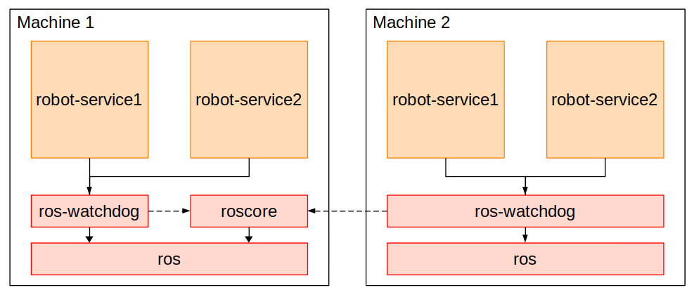

# ROS Daemons <!-- omit in toc -->

ROS Daemons provide the ability to start certain elements of the ROS ecosystem on boot using the [systemd software suite](https://en.wikipedia.org/wiki/Systemd). This is useful for robots that are required to provide a fixed set of functionality at all times regardless of use-case (e.g., starting up base drivers).

- [Daemons](#daemons)
  - [qcr-env](#qcr-env)
  - [ros-daemon](#ros-daemon)
  - [roscore-daemon](#roscore-daemon)
  - [ros-watchdog](#ros-watchdog)
  - [robot-bringup-daemon](#robot-bringup-daemon)
  - [ros-sensors](#ros-sensors)
  - [ros-robot](#ros-robot)
  - [ros-project](#ros-project)
- [Service Dependency Tree](#service-dependency-tree)
- [Installation](#installation)
  - [Step 1. Adding QCR Apt Repositories](#step-1-adding-qcr-apt-repositories)
  - [Step 2. Installing the Daemons](#step-2-installing-the-daemons)
- [Usage](#usage)
  - [Starting/Stopping the Daemons](#startingstopping-the-daemons)
  - [Accessing Logs](#accessing-logs)
  - [Setting up Robot Bringup](#setting-up-robot-bringup)
- [Usage on a Development Machine](#usage-on-a-development-machine)

## Daemons

This repository is divided into the following five packages:

### qcr-env

The qcr-env package installs the ```qcr-env.bash``` file to ```/etc/qcr/```. This file defines system critical information such as the location of the primary ROS workspace, ROS master location and the launch command that should be exected by the robot-bringup daemon.

*Note*: This file can be optionally sourced within your ```~/.bashrc``` to provide access to robot state information.

### ros-daemon

The ros-daemon package installs the ```ros``` daemon. The ROS daemons is a meta-service that when started brings up the rest of the daemons provided by this repository, and conversely, when stopped will shutdown these same daemons. It should be noted that this package does not execute any ROS software itself.

### roscore-daemon

The roscore-daemon package installs the ```roscore``` daemon. This daemons creates a ROS master by executing the ```roscore``` command on startup - using the system variables defined in ```/etc/qcr/qcr-env.bash```.

*Note*: This service is optional and can be omitted on systems which are not intended to act as the ROS master.

### ros-watchdog

The ros-watchdog packages installs the ```ros-watchdog``` daemon. This daemon is responsible for ensuring that the ROS master specified in ```/etc/qcr/qcr-env.bash``` is alive and managing the life-cycle of its dependent services accordingly. 

In the event that it is unable to contact the ROS master it initiates a restart - causing all depedent services to stop. Until the ROS master is contactable, the ros-watchdog daemon will remain in an *activating* state, preventing its dependent services from restarting. Once the ROS master becomes contactable again however, the ros-watchdog will transition into an *activated* state, and its dependent services will restart.

*Note*: This service can be located on a different machine to the ROS master, facilitating multi-machine management of services.

### robot-bringup-daemon

The robot-bringup-daemon package installs the ```robot-bringup``` daemon. This daemon executes the command specified by the ```QCR_ROBOT_LAUNCH``` variable in ```/etc/qcr/env.bash``` - allowing custom commands such as roslaunch to be initiated at boot.

*Note*: this daemon/service is considered legacy and has been superseded by the ros-sensors, ros-robot, and ros-project meta services.

### ros-sensors

The ros-sensors-daemon package installs the ```ros-senors``` daemon. The ROS-Sensors daemons is a meta-service that when started brings up any dependent services, and conversely, when stopped will shutdown these same daemons. This meta-service is meant to be used as the dependent service for all sensors that should be launched on boot.

### ros-robot

The ros-robot-daemon package installs the ```ros-robot``` daemon. The ROS-Robot daemons is a meta-service that when started brings up any dependent services, and conversely, when stopped will shutdown these same daemons. This meta-service is meant to be used as the dependent service for all components that should be launched on boot required by the robot (e.g., teleoperation node, hardware interface nodes, etc.).

### ros-project

The ros-project-daemon package installs the ```ros-project``` daemon. The ROS-Project daemons is a meta-service that when started brings up any dependent services, and conversely, when stopped will shutdown these same daemons. This meta-service is meant to be used as the dependent service for all components that should be launched on boot for your specific project (e.g., nodes containing research algorithms).

## Service Dependency Tree

To allow for multi-machine configurations, and to provide a simplified mechanism for shutting down the complete set of services, we define a dependency tree, (seen in the image below) that facilitates the ability to manage the robot state at varying levels. For instance, by stopping the *ros* service on Machine 1 using the command ```sudo service ros stop``` the *ros-watchdog* and *roscore* services, which depend on the *ros* service will stop which will in turn cause all depedent services to stop.



Note that the *ros-watchdog* service has a soft dependency on the *roscore* service (indicated by the dashed line). When the *ros-watchdog* service is started, it will enter an initial *starting* state, which prevents any of its dependent services from starting. When it detects the ROS master has started, which it does by polling the ROS master at a frequency of 1hz, it will enter a *started* state, allowing its dependent services to start. In the event that the ROS master does not respond (due to being stopped), the ros-watchdog will go through a restart procedure, which will cause its dependent services to stop, before entering back into its *starting* state and waiting for the ROS Master to come back online.

This design allows us to create services that depend on a ROS Master that may be running on a different machine, a capability that is not provided by regular systemd dependencies.

## Installation

Installation of these packages is intended to be done through the APT package manager.

### Step 1. Adding QCR Apt Repositories
Import the GPG Key using the following command

```sh
sudo -E apt-key adv --keyserver hkp://keyserver.ubuntu.com --recv-key 5B76C9B0
```

Add the Robotic Vision repository to the apt sources list directory

```sh
sudo sh -c 'echo "deb [arch=$(dpkg --print-architecture)] https://packages.qcr.ai $(lsb_release -sc) main" > /etc/apt/sources.list.d/qcr-latest.list'
```

Update your packages list

```sh
sudo apt update
```

### Step 2. Installing the Daemons

Install the roscore-daemon (optional) and robot-bringup-daemon
```
sudo apt install -y ros-noetic-roscore-daemon ros-noetic-robot-bringup-daemon
```

*Note*: As part of the installation process, the daemons will automatically startup and register themselves to start on boot.

## Usage

### Starting/Stopping the Daemons
Managing the state of the daemons in this package can be accomplished through the use of either the ```service``` or ```systemctl``` commands:

```sh
sudo service {{daemon name}} [start|stop|restart|status]
#OR
sudo systemctl [start|stop|restart|status] {{daemon name}}
```

Where ```{{daemon name}}``` is the name of the daemon you wish to manage (i.e., ros, roscore, ros-watchdog, robot-bringup).

### Accessing Logs
Accessing stdout logs from each of the daemons can be accomplished using the ```journalctl``` command:

```sh
journalctl -u {{daemon name}} --follow --lines 500
```

Where ```{{daemon name}}``` is the name of the daemon you wish to manage (i.e., ros, roscore, ros-watchdog, robot-bringup).

### Setting up Robot Bringup

*Note*: the Robot Bringup service is considered legacy and has been superseded by the ros-sensors, ros-robot, and ros-project meta services.

The command executed by the ```robot-bringup``` daemon is defined by the ```QCR_ROBOT_LAUNCH``` variable in ```/etc/qcr/qcr-env.bash```. An example of how to use this variable can be seen below:

```
export QCR_ROBOT_LAUNCH="roslaunch joy_teleop example.launch"
```

**Important:** The robot-bringup daemon must be restarted after making changes to the ```QCR_ROBOT_LAUNCH``` variable using the command 

```sh
sudo service robot-bringup restart
```

## Usage on a Development Machine
The ```/etc/qcr/qcr-env.bash``` file installed by the qcr-env package is copied from a template file that is located in the system install lcation for ROS (e.g., /opt/ros/noetic/share/qcr_env/). This file is only copied if ```/etc/qcr/qcr-env.bash``` does not already exists.

This allows local changes to be preserved when the package is upgraded, and additionally, allows local changes to be tracked after installation using the [QCR robot_system_config tools](https://github.com/qcr/robot_system_configs).

