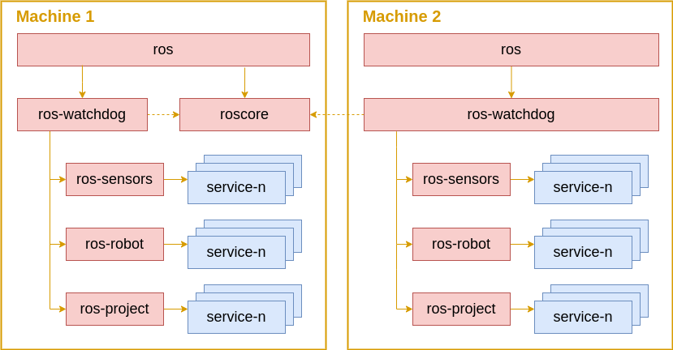

# ROS Daemons

ROS Daemons provide the ability to start certain elements of the ROS ecosystem on boot using the [systemd software suite](https://en.wikipedia.org/wiki/Systemd). This is useful for robots that are required to provide a fixed set of functionality at all times regardless of use-case (e.g., starting up base drivers).

## Creating a Service

All services in this repository are catkinised to simplify the build and distribution process. To create a new ROS Daemon package within this repository, simply execute the command:

```sh
catkin_create_pkg {{robot_daemon}}
```

where ```{{robot_daemon}}``` is the name you wish to give the service.

All packages must include the same general set of files, which are:

```
{{robot_daemon}}
    - debian
      - postinst
      - prerm
    - etc
     - {{robot_daemon}}.service.in
```

where:

- ```{{robot_daemon}}.service.in``` is a template file from which the service file is generated. The variables in the template file will be determined by the linux and ROS distributions on the system.
- ```postinst``` is a script that registers and starts the service when the package is distributed as a debian.
- ```prerm``` is a script that stops and unregisters the service prior to uninstalling the debian package

### Service File Template

The general structure of the ```{{robot_daemon}}.service.in``` template file is as follows:

```
[Unit]
Description=[SERVICE DESCRIPTION]
Requires=ros-watchdog.service
After=ros-watchdog.service

[Service]
EnvironmentFile=/etc/ros-env.conf
PassEnvironment=ROS_MASTER_URI ROS_IP ROS_HOSTNAME
ExecStart=/bin/bash -c "source @CMAKE_INSTALL_PREFIX@/setup.bash && roslaunch [ROS PACKAGE] [ROSLAUNCH FILE].launch"
Restart=always
RestartSec=5

[Install]
WantedBy=multi-user.target
```

where [SERVICE DESCRIPTION], [ROS PACKAGE] and [ROSLAUNCH FILE] should be replaced.

For an explanation of the ```ros-watchdog.service```, see the section on the Service Dependency Tree at the end of this README.

### Post Install Script

The ```postinst``` script is generally very simple, with the following format:

```sh
#!/bin/bash

systemctl daemon-reload

systemctl enable {{robot_daemon}}.service
systemctl start {{robot_daemon}}.service # use --no-block to stop apt from waiting for this service to start
```

Where ```{{robot_daemon}}.service``` is the same name as your ```{{robot_daemon}}.service.in``` file minus the file ```.in``` extension.

### Pre Uninstall Script

The ```prerm``` script is likewise very simple:

```
#!/bin/bash

systemctl stop {{robot_daemon}}.service
systemctl disable {{robot_daemon}}.service

systemctl daemon-reload
```

## Building an Executable
Building an executable for your daemon is accomplished through the use of a GitHub action, which is activated whenever a new release is published.

Please note that you should define a version for your service in the ```package.xml``` file created with your package.

## Service Dependency Tree

To allow for multi-machine configurations, and to provide a simplified mechanism for shutting down the complete set of services, we define a dependency tree, (seen in the image below). For instance, stopping the *ros* service on Machine 1 using the command ```sudo service ros stop``` will cause the *ros-watchdog* and *roscore* services to stop, which will then cause the *robot-service1* and *robot-service2* services to stop.



Note that the *ros-watchdog* service has a soft dependency on the *roscore* service (indicated by the dashed line). When the *ros-watchdog* service is started, it will enter an initial *starting* state, which prevents any of its dependent services from starting. When it detects the ROS master has started, which it does by polling the ROS master at a frequency of 1hz, it will enter a *started* state, allowing its dependent services to start. In the event that the ROS master does not respond (due to being stopped), the ros-watchdog will go through a restart procedure, which will cause its dependent services to stop, before entering back into its *starting* state and waiting for the ROS Master to come back online.

This design allows us to create services that depend on a ROS Master that may be running on a different machine, a capability that is not provided by regular systemd dependencies

